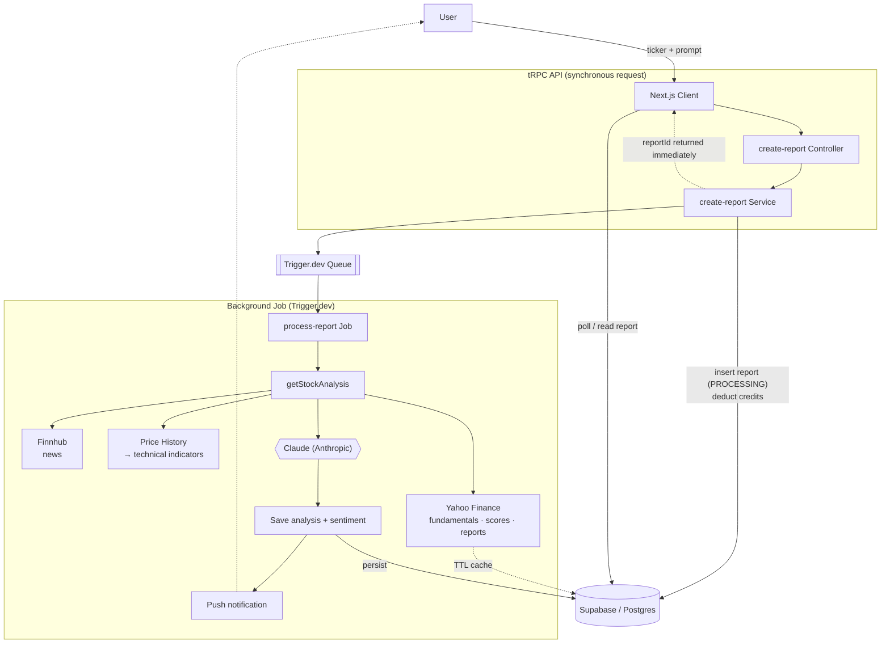

# BrewStockAI

AI-powered stock analysis — get institutional-grade financial insights, market sentiment, and technical indicators for any equity. For less than a coffee ☕

## Technical Tools

Some cool highlighted tools this project uses:

- **[Effect](https://effect.website):** a powerful TypeScript library designed to help developers easily create complex, synchronous, and asynchronous programs.
- **[tRPC](https://trpc.io):** end-to-end typesafe APIs, used to expose Effect services to the client.
- **[Trigger.dev](https://trigger.dev):** background job processing for long-running AI analysis tasks.
- **[Supabase](https://supabase.com):** Postgres database with auth and real-time capabilities.
- **[Vercel AI SDK](https://sdk.vercel.ai):** streaming AI responses with structured output using Claude (Anthropic).
- **[TanStack Query](https://tanstack.com/query):** server state management and caching on the client.
- **[Puppeteer](https://pptr.dev):** headless browser used to generate PDF exports of analysis reports.

## Code Quality Tools

This project uses automated code quality tools to maintain consistency:

- **[vite-plus](https://github.com/vite-plus/vite-plus):** unified toolchain that bundles linting, formatting and testing:
    - **oxlint:** Rust-based linter (replaces ESLint)
    - **oxfmt:** Rust-based code formatter (replaces Prettier)
    - **Vitest:** unit testing
- **[Knip](https://knip.dev):** detects unused files, exports, and dependencies.
- **TypeScript:** provides type safety.
- **[Husky](https://typicode.github.io/husky):** runs pre-commit hooks automatically.

## How It Works

