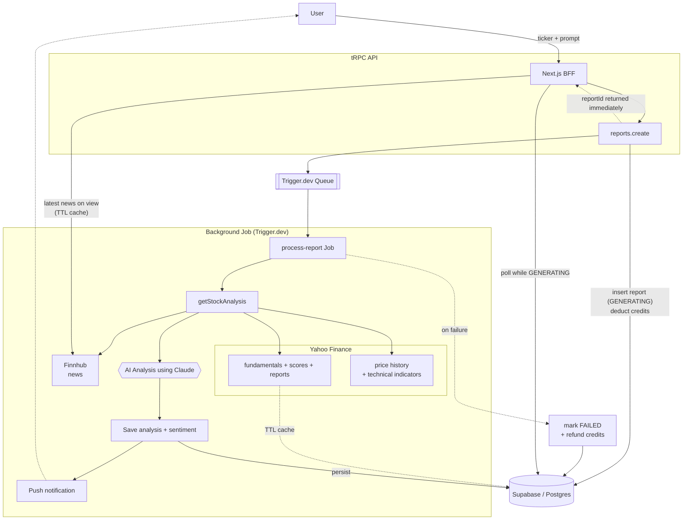

# BrewStockAI

AI-powered stock analysis — get institutional-grade financial insights, market sentiment, and technical indicators for any equity. For less than a coffee ☕

## Technical Tools

Some cool highlighted tools this project uses:

- **Effect:** a powerful TypeScript library designed to help developers easily create complex, synchronous, and asynchronous programs.
- **tRPC:** end-to-end typesafe APIs, used to expose Effect services to the client.
- **Trigger.dev:** background job processing for long-running AI analysis tasks.
- **Supabase:** Postgres database with auth and real-time capabilities.
- **Vercel AI SDK:** streaming AI responses with structured output using Claude (Anthropic).
- **TanStack Query:** server state management and caching on the client.
- **Puppeteer:** headless browser used to generate PDF exports of analysis reports.

## Code Quality Tools

This project uses automated code quality tools to maintain consistency:

- **vite-plus:** unified toolchain that bundles linting, formatting and testing:
    - **oxlint:** Rust-based linter (replaces ESLint)
    - **oxfmt:** Rust-based code formatter (replaces Prettier)
    - **Vitest:** unit testing
- **Knip:** detects unused files, exports, and dependencies.
- **TypeScript:** provides type safety.
- **Husky:** runs pre-commit hooks automatically.

## How It Works

